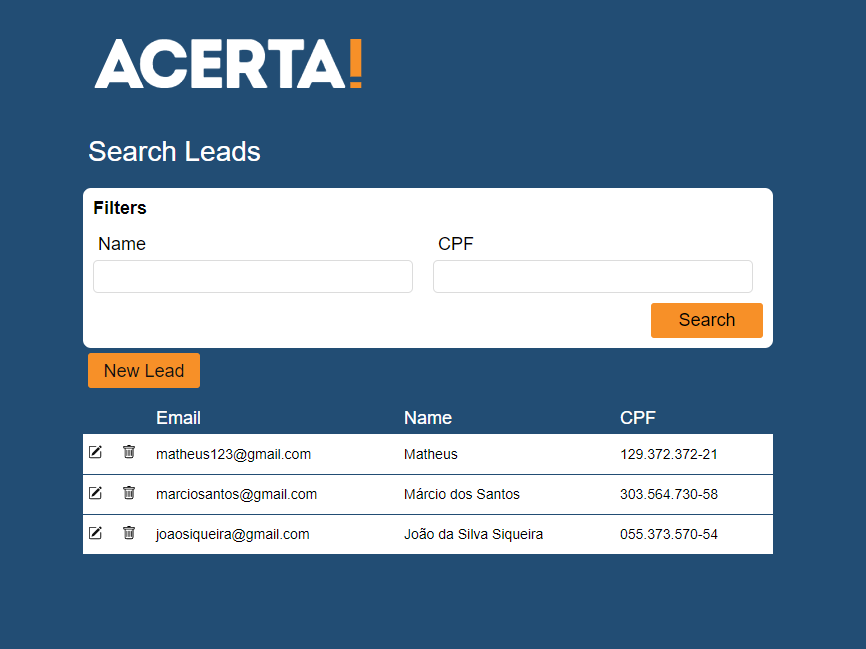
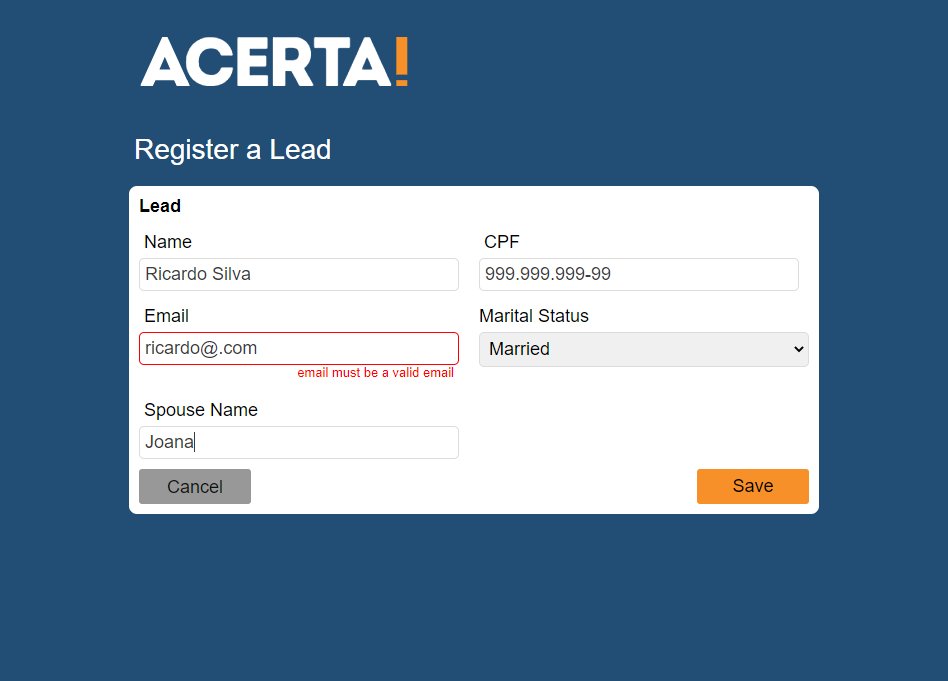
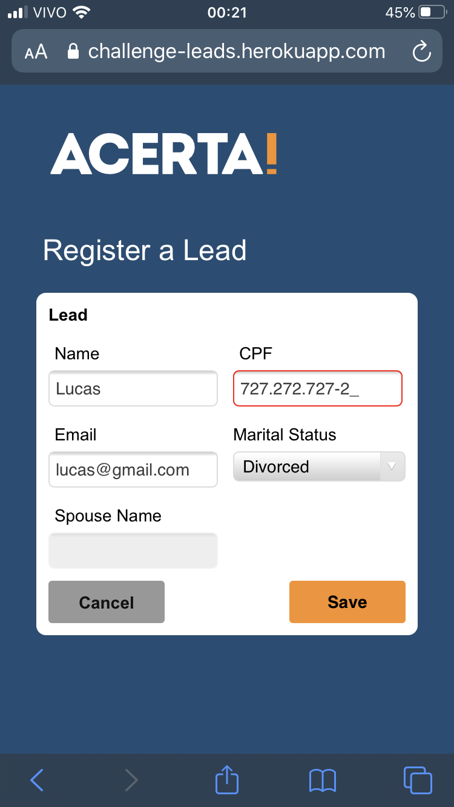
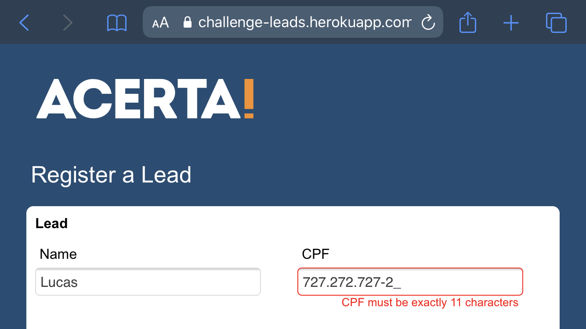

# ACERTA! Leads

## Aplicação web para gerenciamento de Leads

Especificações
=================
<!--ts-->
* [WEB](#tabela-de-conteudo)
  * [Biblioteca](#pre-requisitos)
    * [React with TypeScript](#local-files)
  * [Ecossistema](#tabela-de-conteudo)
    * [React Router – Para navegação](#remote-files)
    * [Formik – Para gerenciamento de formulários](#multiple-files)
      * [Yup – Para validação de formulários](#combo)
     * [React-icons – Para os ícones da aplicação](#tabela-de-conteudo)
     * [React-input-Mask – Para criar máscaras em inputs](#instalacao)
     * [Axios – Para comunicação HTTP](#como-usar)
     * [Styled-Components – Usado como base para a estilização da aplicação](#como-usar)
* [API](#tabela-de-conteudo)
  * [JSON-SERVER - Usado para criar uma "API FAKE"](#tabela-de-conteudo)
<!--te-->

## Funcionalidade
##### A aplicação está funcionando de forma completa, LISTANDO, ADICIONANDO, EDITANDO e EXCLUINDO os dados;
<h1 align="center">
  
</h1>

##### Há validação no formulário na criação e edição;
<h1 align="center">
  

##### Layout totalmente responsivo;
<h1 align="center">
  
</h1>

##### Uso no mobile;
</h1><h1 align="center">
  
</h1>
</h1><h1 align="center">
  
</h1>

### Para utilizar a aplicação, acesse:
#### https://challenge-leads.herokuapp.com/
